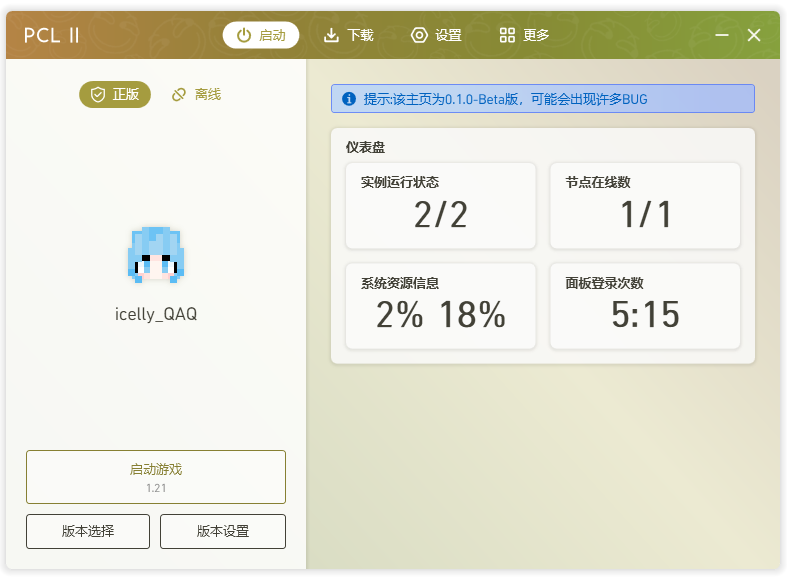

# 让你的PCL2可以监控MCSM！

***该项目为PCL2的主页预设***
#### 预览图

------

### 环境需求
+ node.js >= v15.14.0

### 部署
1. 下载 js 文件
2. 修改文件开头的配置
```
const ip = "xxxxx";      修改为你面板的地址
const apikey ="xxxxx";   修改为你的apikey
（获取apikey的方法https://docs.mcsmanager.com/zh_cn/apis/get_apikey.html）
```
3. 运行
```
node app.js
如果需要指定端口运行则
set PORT=xxxx node app.js （xxxx为你要指定的端口）
```
----
### 声明
该项目遵守 CC BY-NC-SA 4.0 协议


项目作者 icelly_QAQ
